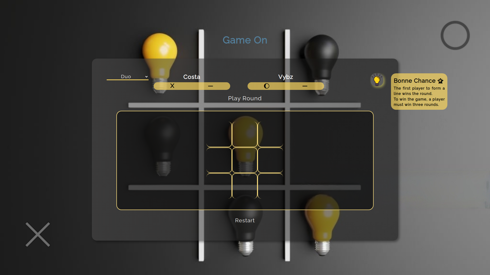

# Tic-Tac-Toe Game

    <h3>💻 Languages</h3>
    
    
    
    <h3>🔧 Technologies</h3>
    
    
    
    <h4><a href="https://asdacosta.github.io/tic-tac-toe-game/">Live Preview</a></h4>

**Demo:**

**
Screen views
**

**Desktop View:**

 

**Mobile View:**

Yet to.

## 🌐 Origin
[The Odin Project](https://www.theodinproject.com/)

## 📝 Description
Builds tic tac toe game.

## 🎯 Relevance
To solidify concepts of `Factory Functions and Module Pattern` in JavaScript. 

## Intended Audience
Developers, users, recruiters.

## Technologies
* `XUbuntu` in Terminal
* `VS` Code

## 📂 Files

Invert

| File | Description |
| - | - |
| `index.html` | Sets structure of page. |
|`style.css` | Style website. |
| `script.js` | Add interactivity and logic for game. |
| `algorithm.txt` | Algorithm for `JavaScript`. |
| `imgs/*` | Images and icon used in the game. |
|`view-imgs`| Contains the live demo and different screen views used in `README.md`.|

## ©️ Credit

Invert

| File | Credence |
| - | - |
| `imgs/bulb.png` | Icon created by Good Ware on [Flaticon](https://www.flaticon.com/free-icons/). |
| `imgs/tictactoe-bg1.png` | Photo by Dilok Klaisataporn on [Istockphoto](https://www.istockphoto.com/). |

## 🔄 Improvements

Invert

- [ ] Create mobile version
- [ ] Create a smart AI with three different difficulty levels.
- [ ] Add local storage for current scores

## 👤 Contributor & Curator
1. [Abraham Da Costa Silvanus](https://github.com/asdacosta) 

 

> [!IMPORTANT]
> Seek contributor's consent for any code usage.

**[🞁 Top](#tic-tac-toe-game)**